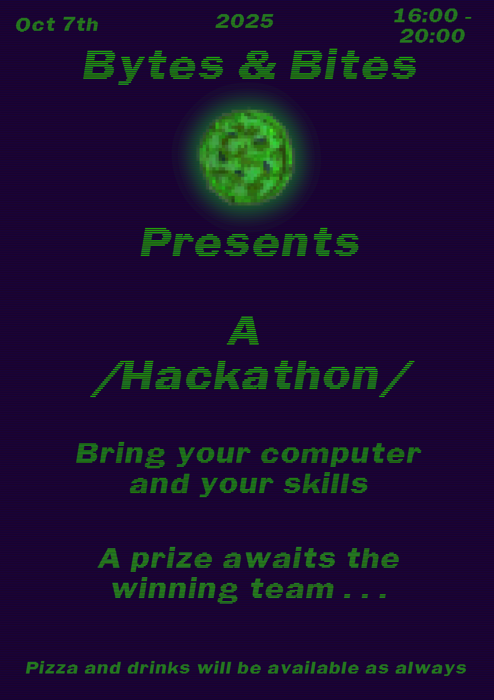

{height=650}

Theme: Chatbots

Guest speakers: 

[Maurice Vanderfeesten](https://maurice.vanderfeesten.name/blog/), who manages research innovation here in the VU, has been testing 
training different models for LLMs. He will show some of his work and outline the process he used for each of the 
models.

[Radu Apsan](https://www.researchgate.net/profile/Radu-Apsan) from the Nebula team in the Network Institute will also give a short presentation on the great 
work they are doing on their LLM stack hosted at the VU, its current capabilities and plans for the future. 

[Elisa Rodenberg](https://libereurope.eu/member/elisa-rodenburg/) will outline the parameters of the chatbot, what it should do, provide some data to work 
with and the typical process and rules of the work the bot should do.

[Register](https://vu-nl.libcal.com/calendar/universitylibrary/BytesBitesOctober2025)

Come one, come all, Bytes & Bites is hosting a hackathon! The gauntlet has been laid down to make a chatbot for use
in the VU. Form a team or craft it solo, for your chance to win the prize! The royal highness has decreed that the
three best entrants will enjoy each enjoy a prize, so try your hand at the challenge.

Pizza and drinks will be served as always!