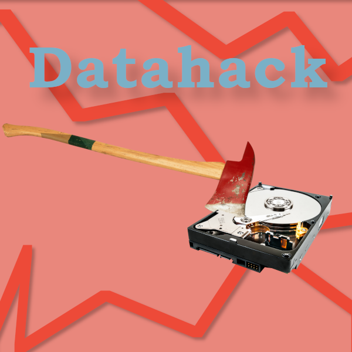

Theme: datahack

{height=300}

# Do you like the programming side, but not the writing side of academia?

On the 24th of April we will be hosting our first ever datahack! 

## What is a datahack?

A dataset or datasets are provided with explanation of the origin, columns, codes, and purpose. The hackers are then let loose on the data to work on it to find completely new insights, make a tool, or create some cool unique graphics.  

  

## How does it work?
Researchers have kindly donated some datasets that they wanted to do more with but perhaps didn't have the time, money, or skills. That's where you come in. This all day event is for solo hackers or teams to work on a dataset to: bring the data dreams to life, find completely new insights, make an analytical tool, or create some cool unique graphics.  

  

[Register](https://libcal.vu.nl/event/4508414)  
[Donate data](https://forms.office.com/Pages/ResponsePage.aspx?id=nJwqRqYt-0uzGA-DBD_km4HqWtL4iLFHsVXEaG3GTI1UQ09ZR1RON0M5UUhDTzZYQkw5SUUyWjY3OS4u)

  

Researchers will provide an explanation of the project and its aims as well as a walkthrough of the datasets provided. Some researchers may also be available during the hack to answer questions you have about quirks of their field or dataset. At the end of the session you can add a link to your repo to the project list with an explanation of what you did, how it works, and what else you would like to add. If the researcher likes it they might write a paper about it and you will be credited for your work!

## Things to Note

This is a daytime event that runs a long time, so we expect the hackers and researchers to drop in and out as fits their agenda. 

Pizza and drinks will be provided as always!