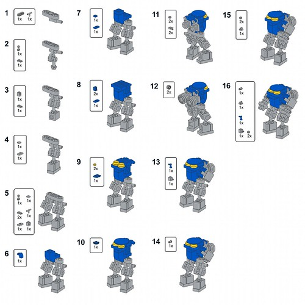

Theme: Documentation, Fundamentals
Level: 1+

**Note: This is a re-organisation of the event that didn't go ahead in February.**

Guest speakers: [Charlie Greene](https://libcal.vu.nl/profile/fb462e443245), the VU library research software engineer will be hosting the May edition of Bytes & Bites where we will be playing with LEGO! 

[Register](https://libcal.vu.nl/calendar/universitylibrary/Bytes_and_Bites_May_2026)

The colourful bricks can be used to make anything you want and in this session they will help us learn more about documentation! So bring your creative mindset and we'll bring the LEGO, see you there!

Pizza will be served as always!