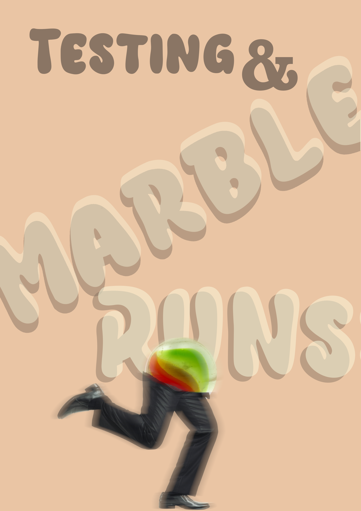

{height=300 fig-align="center"}

Theme: Testing, Fundamentals

[Level](../about.qmd): 1+

[Charlie Greene](https://libcal.vu.nl/profile/fb462e443245), the VU library research software engineer will be hosting the September edition of Bytes & Bites where we will be playing with marble runs! 

[Register](https://libcal.vu.nl/calendar/universitylibrary/Bytes_and_Bites_Sep_2026)

The chaos of a marble run might not be something you have experienced since you were a child (or since you last watched [Jelle's Marble Runs](https://www.youtube.com/@JellesMarbleRuns)), but we will be returning to it in this session. Despite the fun and chaos there will some learning about testing in software. So, bring your favourite cat's eye and we'll see you there!

Pizza will be served as always!