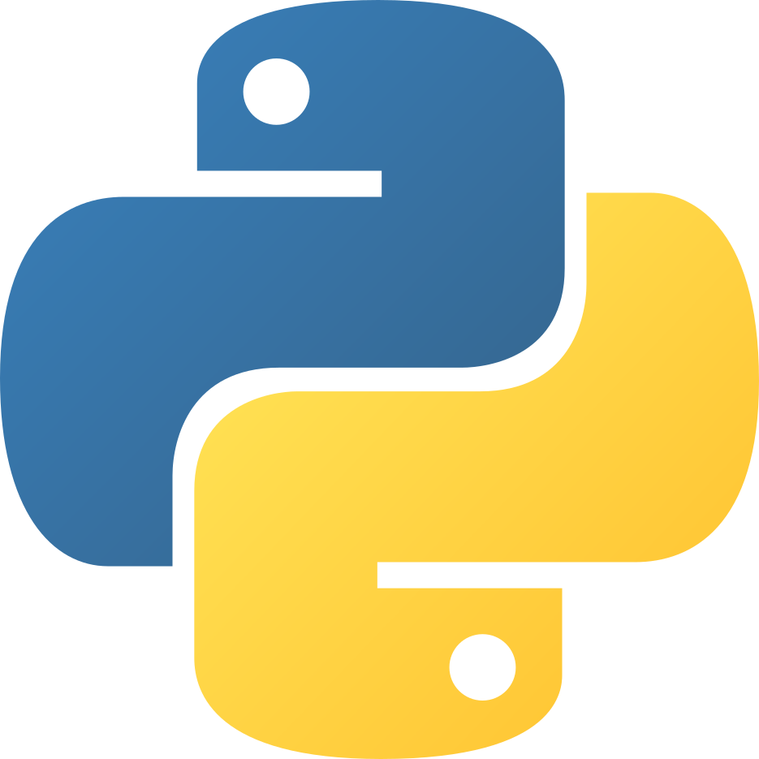
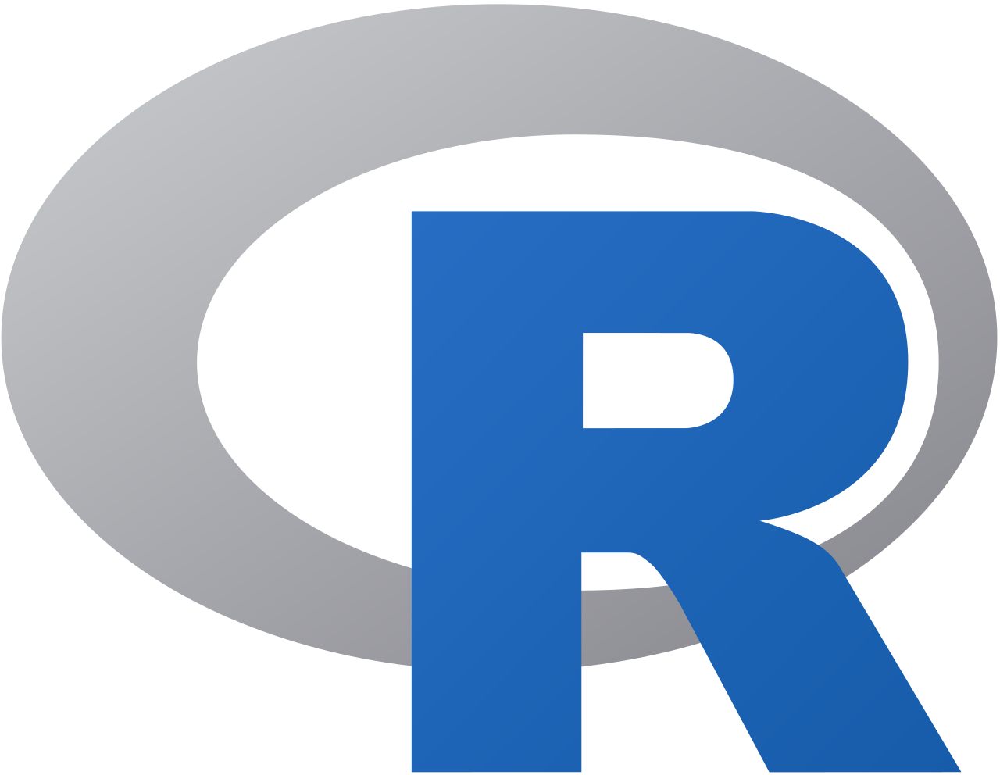
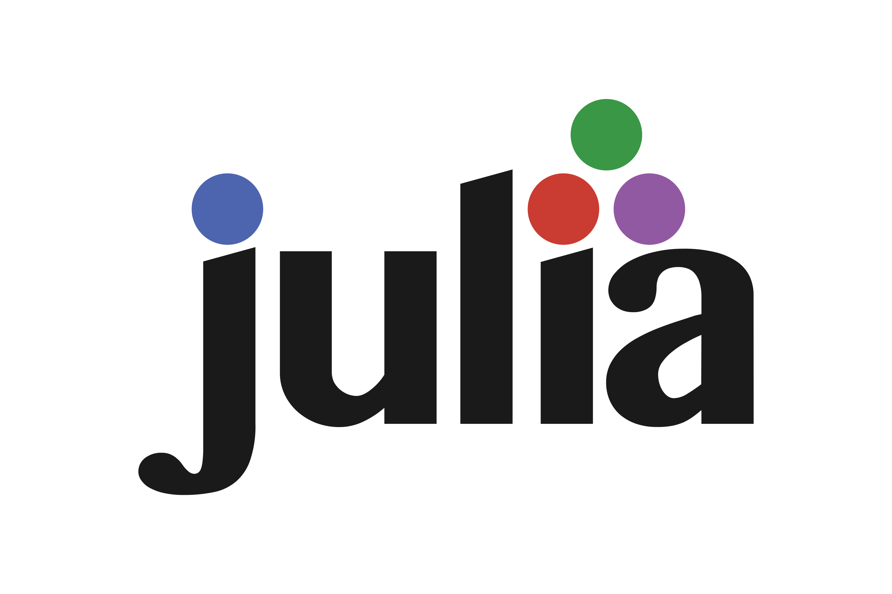

## Introduction

Below is a list of useful learning materials for common programming languages (as well as any other sources found along the way). The materials are grouped by topic starting with general sources - places that cover everything in a reasonably clear and explanatory way. 
Please refer to these materials if you cannot find anything in our documentation or want to start on your learning journey in your own time. Do remember that while we endeavour to make sure that our own guides are comprehensive and clear it can always help to give a further understanding of topic when reviewing it from multiple angles. In addition, programming is a solution to a puzzle and the puzzles always have multiple solutions. So, while our solution (methods) might not suit your style, perhaps someone else’s does. 

If you come across any sources not in this list that you think could be useful, please reach out and contact the team via the [contribution portal](https://ez-github-contributor.netlify.app/) and we will review it for adding to the list.

### Live code-along sessions
If you are looking for additional sessions to Bytes & Bites you can perhaps find support in the [codebar](https://codebar.io/) sessions though do note that as a student “_workshops and events are exclusively for women, non-binary, LGBTQ+ members (mirrored also in the [rainborR](https://rainbowr.org/) buddy programme), and people from underrepresented minority groups_”. They do however upload their talks to [their youtube channel](https://www.youtube.com/@codebarhq/videos), much like [PyData](https://www.youtube.com/user/PyDataTV) (talks mostly on data analysis in various languages).

### Coding courses
There are many places peddling their coding courses these days, however there are still plenty of good quality free courses. In general you can find everything you need to learn for free in one way or another, including interactive courses.

The UB regularly hosts a coding course for beginners based on the Carpentry workshops, so search for Software Carpentry in the events page of the VU Amsterdam!

#### Honourable mentions
___________________

[Swirl](https://swirlstats.com/) – R – An R package that teaches you to code in line. Install the package, call upon it and follow the instructions. There are also websites to help with solutions when you are stuck. 

[The Turing Way](https://book.the-turing-way.org/) - A community driven overview of how you can perform open science research with regards to data, code, planning, collaboration and more. 

[RSQKit](https://everse.software/RSQKit/) – Overview – Provides an overview of best coding practices in science including (but not limited to) management, citation, sharing code, and pipelines.

[Intro to programming in R](https://github.com/SofiaG1l/R_Course) - A course from the VU Amsterdam's very own Sofia Gil-Clavel

[HTML for people](https://htmlforpeople.com/) - HTML is not a programming languages, but seeing as the ability to craft a website or frontend for a tool is very useful this resource gets an honourable mention.

[Introduction to Python](https://datalab01.ict.hva.nl/) by Pieter Bons of the HvA is a selection of short videos walking you through the basics of using Python. 

#### Free coding courses

[W3Schools](https://www.w3schools.com/) – All – A site with free courses for all sorts of programming languages that also has embedded coding playgrounds, tests, questions, and cheatsheets. 

[OSSU Compsci course](https://github.com/ossu/computer-science) - Mixed - A (mostly) free comprehensive computer science course from mixed resources with a community for discussion, questions, and trouble shooting.

[MIT OpenCourseWare](https://ocw.mit.edu/collections/introductory-programming/) – All – MIT has a series of free courses from introductory to intermediate. You can pay if you want your work marked and to get a certificate, otherwise it is not needed. 

[The Carpentries](https://carpentries.org/lessons/) - Research related programming - An international programme that has been running almost 30 years that has introductory courses on topics covering shell, Git, Python, R, and more.

[eScience center](https://www.esciencecenter.nl/training-materials/) - The Netherlands has several centralised support groups, one of the better known ones is the eScience center. To attend their courses costs, but they keep their learning materials free, so you can follow them in your own time.

[CodeRefinery](https://coderefinery.org/) provides intermediate level courses for software management, data management, and project skills, orientated around research. The courses are free to join and you can review the older courses that have been recorded either on Twitch or Youtube. To ask questions in the session you will need an account for those services. 

[AI@VU](https://vu-ai-hub.vercel.app/courses) is a site that is under development to allow you to follow all AI Bachelors courses from the VU.

[SSI Training hub](https://www.software.ac.uk/training/training-hub) - The Software Sustainability Institute in the UK has a selection of trainings in their training hub covering different topics, levels, and programming languages.

#### Paid coding course sites

There are many places to find coding courses, here are a few popular ones:

[Codecademy](https://www.codecademy.com/article): A site that has both paid course and free articles/guides. Ignore the courses you can find some good information in their articles, though perhaps not the best place to get it.

[Datacamp](https://www.datacamp.com/tutorial/): The Etos to the Kruidvat that is Codecademy. Stick to the articles and look elsewhere for courses or topics if you don’t want to pay.

[Coursera](https://www.coursera.org/): Essentially a course marketplace, be sure to read the reviews and check that the topics are relevant. There are free courses or some that provide a free 
option of their course that is a limited version of the paid one.

[edX](https://www.edx.org/): A more refined course marketplace intially started by a US university collective. The courses vary greatly in length (days to years) and cost (free to 10s of thousands of euros), again it is worth checking the reviews before signing up to one.

### Programming forums

There are a lot of places to discuss programming and majority of mixed forums (or social media) will have sections to discuss programming these days. In fact many frameworks, libraries, packages, and services that are large enough will have their own forum for troubleshooting and to discuss use cases.

Undoubtably the largest and most extensive programming forum collection is [StackOverflow](https://stackoverflow.com/). StackOverflow is forum for discussing and asking all sorts of programming questions and as a result you can find an answer for almost any sort of problem. Be aware when posting that the users are very strict on the posting rules and can come across as unfriendly. To avoid bots and spamming you have to get enough points (via contribution) in order to comment, vote, etc. In the long run this helps to avoid manipulation and spreading of bad practice, but does not make a beginner friendly community. 

### Articles & Guides

[Delftstack](https://www.delftstack.com/): This is a site full of tutorials in several languages, it is a passion project, so not every topic is covered. As you might have guessed the name is inspired by the city, but it not explicitly related to the university or city. 

[Medium/TowardsDataScience](https://towardsdatascience.com/latest/): A platform where users are paid to write articles about various topics, not everything is always fully explained or understood by the writers, but you can find some niche topics of relatively clear intros to topics there. Be aware that it might not promote the best coding practices and that is not usually the aim.

[GeeksForGeeks](https://www.geeksforgeeks.org/): A more to the point version of Medium/TowardsDataScience with slightly less reputable articles and more frequently outdate code. It can be useful, but take the code as a guide to get the basics working and restructure the code to fit good coding practices. 

### Python

{width=200}

#### General
_______

##### Articles & Guides
[Mouse vs Python](https://www.blog.pythonlibrary.org/) is an extensive python themed blog by Mike Driscoll writing small guides on the solution he found for a problem he faced in his work. There are a lot of more niche topics covered here. 

[Real Python](https://realpython.com/) is a large blog with multiple contributors and has indepth posts and guides on topics ranging from beginner topics to more complex fundamentals. 

[Al Sweigart](https://inventwithpython.com/), an Python powerhouse, has many books covering different topics, and has several of them freely available to read online. The topics of the books range from automation to game development to recursion to automation to game development to recursion to automation to game development to recursion to `break…`

[python-course.eu](https://python-course.eu/) is a website that covers all the fundamentals (from beginner to advanced) of programming in python using mostly standard Python libraries meaning few installations are needed.

[TheLinuxCode](https://thelinuxcode.com/tag/python/) A blog site from a seasoned programmer Augusto Dueñas writing about all manner of topics that he has come across or worked on. This is the filtered list for Python posts only.

##### Books
[Python for Scientists](https://wiki.physics.udel.edu/wiki_qttg/images/3/31/BOOK%3Dpython_for_scientists.pdf) is a book by John M. Stewart from the Department of Applied Mathematics & Theoretical Physics written for the use of Python in research.

[Python for Scientists](https://pythonforscientists.github.io/), another book of the same title. It is "_an open-source Python textbook designed for introductory courses in computer science or scientific computing. As opposed to other textbooks, which only cover the fundamentals of coding itself, Python for Scientists also provides students with good programming and development skills. Written for students at Kenyon College_".

##### Assignments
[Introductory level - ASC](https://github.com/ubvu/Python-Software-Carpentry/tree/main/Introductory/Homeworks) homeworks are intended for those who have followed a beginners Carpentry course or an equivalent introduction level Python course or self study. The first homework can be done twice, first with simple techniques (no loops or functions), second using more advanced methods. The second homework introduces a little more than is covered in the regular beginners Python course taught by the UBVU and is closer to the beginner+ course. 

##### Videos
[Arjan codes](https://www.youtube.com/@ArjanCodes) is a channel that covers all sorts of programming conventions and tips to keep clean and sustainably scalable code. 

#### Web tools and Dashboards
_______

##### Video
[Andriana Fanilo](https://www.youtube.com/c/faniloandrianasolo) is a Streamlit expert and developer who regularly produces short videos on how to develop webapplets (in Python) using Streamlit as well as developing new features himself.

### R

{width=200}

#### General
_______

##### Articles & Guides

[R Studio Education](https://education.rstudio.com/), a collection of educational resources for R split into skill levels.

[CCS R Course Materials](https://github.com/ccs-amsterdam/r-course-material/tree/master) _"a collection of R tutorials, developed at the Vrije Universiteit Amsterdam for Communication Science courses that use R."_ From data wrangling to data scraping, simulations to LLMs, if the Communication Science team has taught an R course on it, you can find it here.

[Statology](https://www.statology.org/) has a big focus on status (who would have guessed!) and as a result has a lot of comprehensive R articles. [Check them out here!](https://www.statology.org/r-guides/)

##### Books
The [Communcation Science R Book](https://dataliteracy.cc/) is a web-book developed by the communication sciences team in the VU Amsterdam that covers all the concepts needed to start with using R for statistical analyses including concept explanations alongside the code guides.

[R for Data Science](https://r4ds.had.co.nz/introduction.html) is the website for the first edition of “R for Data Science”, published January 2017 by Hadley Wickham and Garrett Grolemund. The book covers all the basics needed for coding R projects in a scientific way.

[Hands-on Programming with R](https://rstudio-education.github.io/hopr/) is another website edition of a book, and a great starting point for those wanting to learn how to code. It is also written by Garrett Grolemund.

##### Inline or Interactive
[Swirl](https://swirlstats.com/) is an R package that teaches you to code in line. Install the package, call upon it and follow the instructions. There are also websites to help with solutions when you are stuck. 

[TidyTuesday](https://github.com/rfordatascience/tidytuesday) is a weekly event where a dataset is released and programmers are let loose upon it. The idea is to create the an attractive and or informative collection of graphics that give some insight from the dataset. An article is written about it and the code used to produce the analysis and graphics is provided at the end of it. It's a great way to learn some more interesting and real life programming and design skills.

##### Assignments
[Introductory level - ASC](https://github.com/ubvu/R-Software-Carpentry/tree/main/Introductory/Homeworks/R_Homework) homeworks are intended for those who have followed a beginners+ Carpentry course or an equivalent introduction level R course or self study. If you have followed the regular beginners course you can try this as the answers are available too.

#### Web tools and Dashboards
_______

##### Articles & Guides
[Mastering Shiny](https://mastering-shiny.org/preface.html) is a free web book from Hadley Wickham that clearly and extensively covers everything you might want to know to create your own interactive dashboards and web tools using R. Just don't forget to keep sensitive and personal data or passwords safe before making your tool live!

[Shiny Basics](https://shiny.posit.co/r/getstarted/shiny-basics/lesson1/) is what is says it is. It is a short walkthrough to help new users to start using R Shiny, provided by the creators of R Shiny and RStudio, Posit.

### Javascript

{width=200}

#### General
_______

##### Articles & Guides
[TheLinuxCode](https://thelinuxcode.com/tag/javascript/) A blog site from a seasoned programmer Augusto Dueñas writing about all manner of topics that he has come across or worked on. This is the filtered list for JavaScript posts only.

#### Video
[Hyperplexed]() a youtube channel that has videos on various tips and tricks to make attractive web pages.

### Julia

{width=200}

#### General
_______

##### Articles & Guides

[Official julialang learning list](https://julialang.org/learning/) - A diverse collection of learning materials and methods in one easy to check list!

[JuliaTutorial.jl](https://kathesch.github.io/JuliaTutorial.jl/dev/) is a quickstart guide for the Julia language. 

[JuliaAcademy](https://juliaacademy.com/) is a collection of free courses to learn julia for all different reasons with many different approaches.

##### Books

[Julia for Optimisation and Learning](https://juliateachingctu.github.io/Julia-for-Optimization-and-Learning/stable/) is a web book based on a course taught at the [Czech Technical University](https://www.cvut.cz/en/) in Prague.