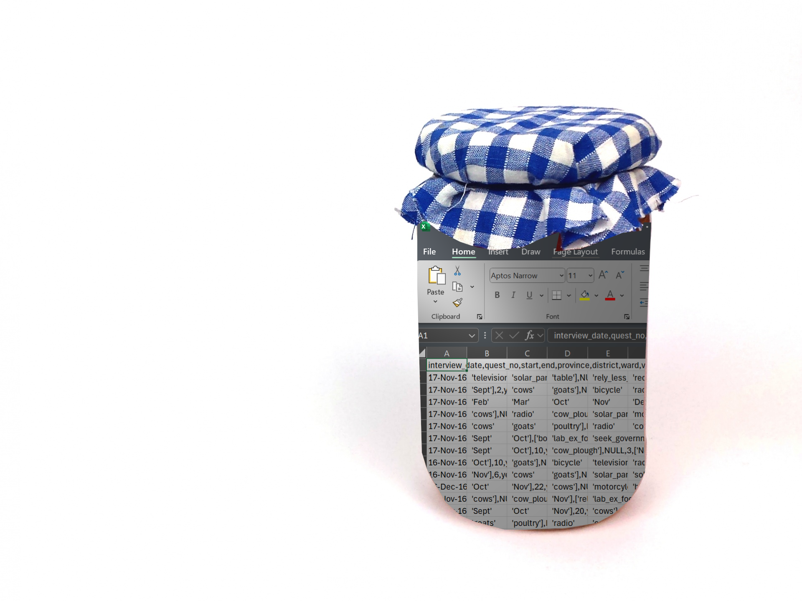
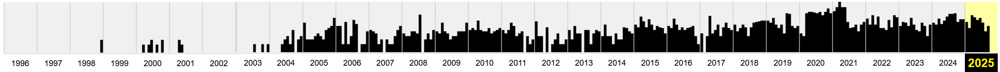

{height=300}

# It's world digital preservation day today, what does that mean?

Well, as the name states, it is about preserving objects that are both natively digital and physical objects in the digital world. As the world becomes ever more digital and trillions of bytes of data are recorded every day humans are leaving less of a footprint in the creative, knowledge, and cultural parts of society (there is more rubbish than ever for future archaeologists to discover and gain insights into our present day, or get confused in the case of Labubus) and as a result swathes of cultural fads can be lost. The interconnectedness of the world means there's a huge amount of cultural crossover and new trends come and go with varying popularity and lifetimes. How many reading this even remember what the big meme of January 2025 was? 

It was "I've played these games before" from the second series of Squid Games by the way. _Unless_ you're engaging more with "brainrot" then it was the Eye of Rah, the cyclops character of [Jeremiah Spingfield](https://www.instagram.com/frightenedsheep25937582/) inspired by the film The Odyssey. But those who are politically engaged would argue that the biggest meme was Elon Musk's Nazi salute. Except it wasn't for American users of TikTok as the ban came into effect and users moved to 小红书 (RedNote). And those adjacent to the manosphere were most likely watching "I Bought a Property in Egypt" edits. 

You might have remembered one of these before the reminder, but did you rememebr[^1] them all? Did you even know them all? Millions and billions of views, millions of hours of watch time, global reach, and that is just in the English speaking internet. All of this to say that there is a huge amount of culture that is being forgotten by the majority even just from this year. In fact, there is significant enough challenge in remembering these trends that the programme [Big Fat Quiz of the year](https://www.channel4.com/programmes/big-fat-quiz) exists. To research this post out I referred to the website [Know Your Meme](https://knowyourmeme.com/editorials/poll/see-the-winner-of-january-2025s-meme-of-the-month) a self proclaimed database of memes that attempts to track the origin, meaning/intention, and the spread of memes. This is a sort of open source internet culture history centre with news, interviews with the subject of memes, explainers, even short white papers. It might not been seen as particularly academic, but it fulfills an important role in digital preservation. 

  

> "_We’ve taken a lot of things for granted…And one of the things that I think people took for granted were libraries…In this era of book banning and alternative facts, I am so deeply grateful for the work that this great archive does_" 
>
> --  California State Senator Scott Wiener

  

Something you might recognise as more of a household name, if your household was primarily focused on digital preservation, is the internet archive (also known simply as [archive.org](https://archive.org/)) that again, as the name states, archives the internet. At the point of writing the archive contains approximately 916 billion web pages, not an insignificant amount! This is probably what is is best known for as users make use of their web crawlers (see scrapers) allowing others to find information that might be otherwise lost or blocked in their country. The name The WayBack Machine might mean something to you, it is the flagship service of the non profit that is the internet archive. It allows users to view scraped pages on a timeline and review the changes over time something that can provide accountability or a blast from the past. 

## Looking back

{height=300, width=1000}

As an example we can [look back at symbolics.com](https://web.archive.org/web/20100815000000*/symbolics.com) (the first ever registered domain) and the first thing you will see is the first ever time it was picked up by a crawler (the 7th of December 1998) and the most recent time it was scraped with over 2,500 saves in that timeframe. Below this is the timeline with a bar graph per year to show the scrapes per month and selecting any year will give a calendar with highlighted dates when the page was scraped. Being the oldest registered domain means we have a wealth of history to examine and allow you to witness the heyday of popups (thankfully we're past that as I think 10 chrome windows blaring music and with flashing images opening at once would still crash most laptops). On the flipside with only a single change in its history the wayback machine is the only way to see the purpose of my favourite website [nut.net](http://www.nut.net/) (completely SFW unless there is a new owner since the point of writing).

For those interested in other types of media archive.org is also a space for forgotten software and games (see also [myabandonware](https://www.myabandonware.com/)), music, radio, tv, news, images, and (true to its digital library ethos) books. While not being a perfect system it has acted succesfully as a haven for otherwise commercially forgotten media and datatypes, such as Flash. Once the start for many now successful animators, webdesigners, and game makers it lost all support on the fated New Years Eve 2020 with some reportedly disasterous results for 中国铁路沈阳局集团 (China Railway Shenyang Group) as their operations were planned with a Flash applet. The original article and updates from the rail service have both since been removed, but thankfully the internet archive has [a copy](https://web.archive.org/web/20210114132505/https://mp.weixin.qq.com/s/4ICWRoIb6tki4JXmkswEyg). 

The Internet Archive, of course, also has a selection of over 4000 flash animations that have been stashed there for safe keeping. 

## Specialised archives

Many agencies, institutions, and governments are hard at work digitising their archives in order to further preserve work. One of the more prominent examples being the UN with mission reports, correspondence, classified, and unclassified documents all being available in the [archive website](https://search.archives.un.org/). Scans of old [letters from Einstein](https://search.archives.un.org/s-0921-0032-0003-00006) and [documents from missions](https://search.archives.un.org/ag-022) all accompanied by extensive metadata.

But digital preservation is not limited to mediums of media, whole cities are being digitally preserved [in the case of Deventer](https://stadszaken.nl/artikel/4769/fotorealistische-digital-twin-deventer-is-brug-tussen-leken-en-nerds). The historic city produced a 3D mesh model of the whole city in 2022 allowing for developers of buildings and software alike to make use of it to help improve the city. It is a part of the broader movement to create _Digital Twins_ of real world locations and buildings, and monuments. 

And the Digital Twins work has not stopped at human made objects because in 2019 Wageningen University began creating a Digital Twin of a crop of tomatoes in a greenhouse [[1](https://www.wur.nl/nl/project/virtual-tomato-crops.htm)]. Here Digital Twins met simulation and real data from their sensors in their actual greenhouse was fed into the model to develop the twin and grow the virtual crop. This work has since led to a broader project to create infrastructure for developement of Digital Twins of ecosystems [[2](https://research.wur.nl/en/projects/lter-life-a-research-infrastructure-to-develop-digital-twins-of-e/publications/?type=%2Fdk%2Fatira%2Fpure%2Fresearchoutput%2Fresearchoutputtypes%2Fcontributiontobookanthology%2Fconference)]. 

## Traditional preservation

We can't skip the traditional archivists, libraries and museums. So how are they both adapting to the explosive growth of the digital world? Well, many museums are busy digitising their collections from [the British Museum](https://www.britishmuseum.org/collection/) to the [Smithsonian](https://www.si.edu/openaccess), the [Nation Library of Norway](https://www.nb.no/en/digital-preservation/) to the [Parliament of Kenya Library](https://libraryir.parliament.go.ke/home), everyone is at it. Here in the Netherlands the [Nationale Bibliotheek](https://www.kb.nl/en/about-us/expertise/digital-preservation) alone preserves over a billion files amounting to over 1.5PB (1,500,000 GB, or a little over 33 Billion copies of the Bee Movie script) and the [Rijksmuseum](https://www.rijksmuseum.nl/en/collection) has been hard at work to digitally preserve over 800,000 objects allowing visitors to view object that might not regularly be on display or have perhaps not have been on display in their lifetime. With so many at work there are central access points slowly forming to avoid researchers, developers, students, and the interested from having to visit a million and one websites. The EU funded [europeana](https://www.europeana.eu/en/collections) takes institution provided resources and even provides an API to encourage programmers to create using their creative commons and public domain works. Otherwise if you prefer to give the institutions the clicks the more international collective of the [International Committee for Audiovisual, New Technologies and Social Media](https://avicom.mini.icom.museum/technologies/digital-archives/) simply links to institutional archives in a list broken down by country. 

Here [in the VU we have an archive](https://vu.nl/en/about-vu/organisations/vu-archives) of research works, objects of historical importance, maps, art, theses, and more. In fact the art and historical objects are [regularly on display](https://vu.nl/en/about-vu/divisions/university-library/more-about/exhibitions-of-the-special-collections) in the university as part of the work by the special collections team. In recent related project [ 3D models of ancient clay tablets have been made](https://vu.nl/en/about-vu/divisions/university-library/more-about/digital-impressions-creating-3d-models-of-clay-tablets) with the intention of exploring the 3D scanning and printing technologies as well as for object based teaching and learning to bring a more tacticle approach to teaching in the university. This is essentially an extension of the Digital Twins idea where copies can be printed to allow more people to explore or study an object, though we should probably hold off printing a full 1:1 scale of Deventer for now. 

## Endangered data

Despite the best efforts of archivists, libarians, curatists, researchers, and volunteers there is still a lot more to be done to ensure the accessiblity and survival of these works. And while most physical works are regularly tended to and safely stored a few are left behind. One such case is VHS tapes and cassettes, their magnetic strips experience remnance decay (or demagnetisation) on a relatively short time scale. According to Kodak [VHS tapes will deteriorate 10-20% within 10-25 years](https://kodakdigitizing.com/blogs/news/how-long-do-vhs-tapes-last) and [cassettes usually have a lifespan of about 30 years](https://kodakdigitizing.com/blogs/news/do-cassette-tapes-go-bad). This might not immediately seem like a great loss, espcecially for younger readers, but those will contain the memories and snippets of the personal lives of millions of people and beyond that recordings of live TV and Radio. One particularly extraordinary example is of this is the multi talented civil rights activist and archivist [Marion Stokes](https://en.wikipedia.org/wiki/Marion_Stokes) who recorded approximately **71,000** VHS tapes from pre-recorded programmes like _The Oprah Winfrey Show_ and _Star Trek_ as well as the live news cycle in order to "_protect the truth_" and allow people to assess the material objectively.

So what can we do? Well, the team at the Digital Preservation Coalition (DCP) have produced the [Bit List](https://www.dpconline.org/digipres/champion-digital-preservation/bit-list?view=article&id=2875:bit-list-2019&catid=130), a list of digitally endangered species with five labels from "Lower Risk" to "Practically Extinct" and a sixth label for materials/species that have been highlighted by members of the community, but not yet categorised by the committee. [You can nominate](https://docs.google.com/forms/d/e/1FAIpQLSccvgold3yiCfwlmh6tFFh6DEfhREyWx4M4rnyfgFNZ42o66A/viewform) digital materials you consider to be at risk to be labelled to help sound the alarm, being more active donate materials to the [Internet Archive](https://archive.org/) or [donate money for the cause](https://archive.org/donate/). And on a personal level you can make sure to [archive your work](https://rdm.vu.nl/manuals/yoda/securing_distribution/vault_archive.html) and back up your files [the safe way.](https://help.uis.cam.ac.uk/service/security/cyber-security-awareness/wfh-security/backing-up-securely)

# TL;DR

Your data won't last forever, but there are a lot of ways to support the archiving world; donating materials to the [Internet Archive](https://archive.org/), [donate money for the cause](https://archive.org/donate/), [nominate endangered data types](https://docs.google.com/forms/d/e/1FAIpQLSccvgold3yiCfwlmh6tFFh6DEfhREyWx4M4rnyfgFNZ42o66A/viewform), [archive your work](https://rdm.vu.nl/manuals/yoda/securing_distribution/vault_archive.html), or simply spreading the word.

# Links used as reference & further reading
[Donate to the internet archive](https://archive.org/donate?origin=iawww-TopNavDonateButton)

[A guide on how to digitally archive work](https://guides.lib.umich.edu/c.php?g=992751) by the University of Michigan Library (already archived itself on archive.org)

[symbolics.com](https://www.symbolics.com/), which **currently** acts as an information source on internet history.

[Article on the Flash train trouble](https://arstechnica.com/tech-policy/2021/01/deactivation-of-flash-cripples-chinese-railroad-for-a-day/) from arstechnica.

[A short guide on archiving data in the VU](https://rdm.vu.nl/manuals/yoda/securing_distribution/vault_archive.html)

[Explore Deventer's Digital Twin](https://geohub-de-kien.hub.arcgis.com/)

[^1]: A typo, but I am leaving it as an unintentional pun