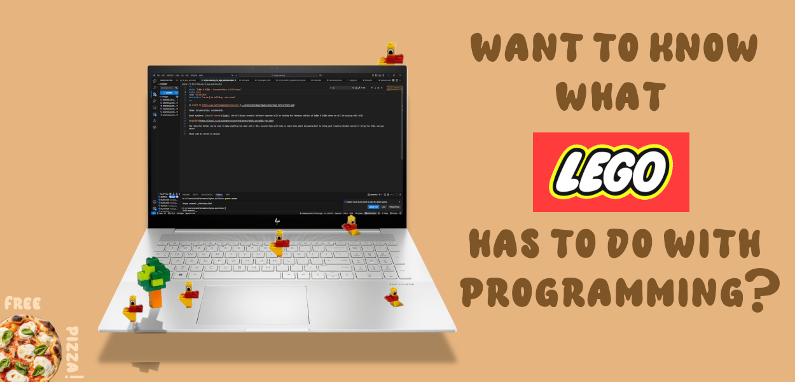

# Bricks and Sketches

Last Tuesday (12/05/2026) we got out the Lego bricks and started playing. The session was inspired by the work of Mary Donaldson and Matt Mahon from the University of Glasgow who created a Lego-based training with the intention of teaching the importance of metadata for reproducibility. The focus of our session was of course more software orientated, and was intended to cover software documentation and software development challenges. There wasn't much to explain so everyone split into 4 groups and got building!

# How does it work?

Each group had a mixture of different lego pieces and was given 10 minutes to make a vehicle. Once the time was up, it was revealed that they would now need to write up a set of instructions describing how the vehicle could be made. After another 10 minutes, it was time for the groups to dismantle their vehicles, pack up the pieces and the documentation, and share it with another group for them to reproduce it.

After a quarter of an hour the recreations were completed and it was time for a comparison! Check out the pictures below to see how well you think it turned out. (The left ones are the original and the right are the recreations)

::: {layout-ncol=2}
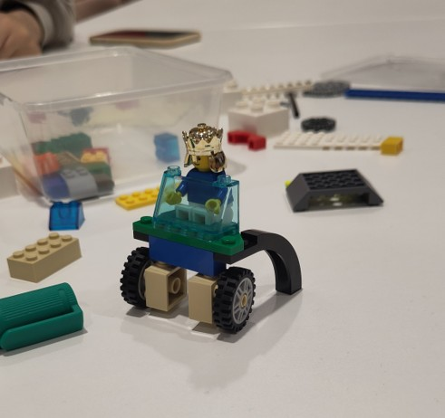{height=300}

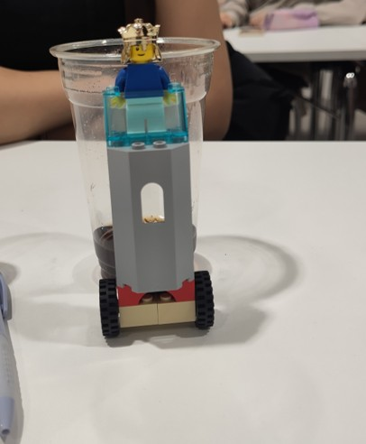{height=300}
:::

::: {layout-ncol=2}
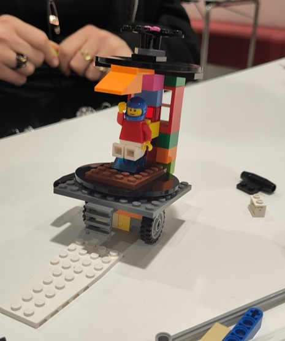{height=300}

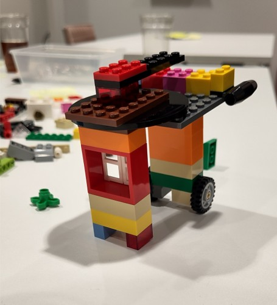{height=300}
:::

::: {layout-ncol=2}
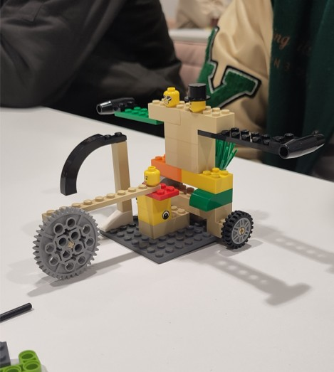{height=300}

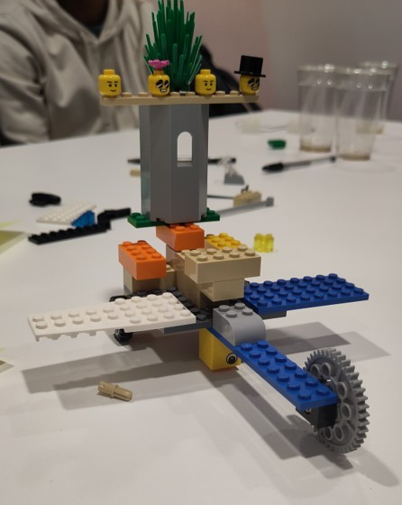{height=300}
:::

::: {layout-ncol=2}
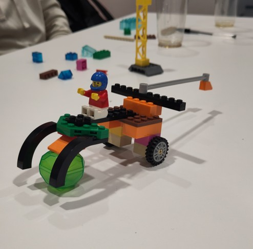{height=300}

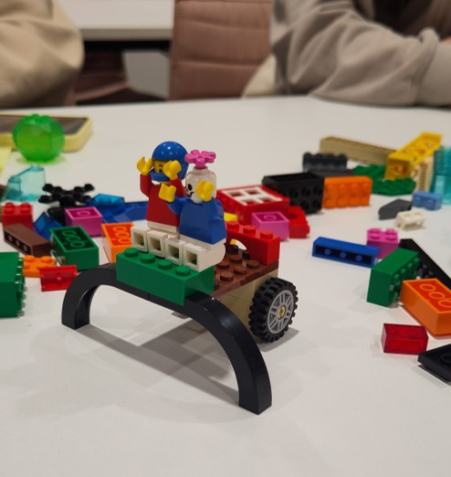{height=300}
:::

# What worked and what didn't?

We found that making the instructions too vague left people unsure of what pieces should be used, but conversely too much detail threw people off. We concluded that the following 4 aspects were key to good instructions:

-   [Quickstarts](https://en.wiktionary.org/wiki/quickstart) are vital, people generally want to read a little and then get started. 

-   Context is king, a small piece for you might not be a small piece for someone else. Your references are relative to your experience.

-   Precision is useful, but knowing when to include that level of detail is important. Starting upfront listing all pieces (like the ingredients in a recipe) is good, waiting till the end to mention those details is perhaps not so good.

-   Describing each step with a small amount of detail is better than ending up with only one step with a lot of detail. Think about that minimum viable product, you can colour in and add the cherry on top later!

# Part two, crafting in the dark

The second challenge built upon what we had just done and, with the new knowledge of what was useful in the documentation, it should be a piece of cake, right? This time the teams had 20 minutes to make a vehicle and write up documentation simultaneously, the catch was that only the documentation would be passed on. The teams didn't know what pieces the other team would have, so they needed to write clear instructions, but with enough lenience that they could be followed with a different set of pieces. 

The intention of this challenge was not just to add another twist, but to get into the mindset of developing software for others and project management. You don't know what route someone might have to take to use your tool or create the one you had planned. As such, you need to plan for strange "pieces" to be used but your documentation should still allow others to reach a working result that resembles what you had in mind. 

Check out the pictures to see if you think the teams succeeded.

::: {layout-ncol=2}
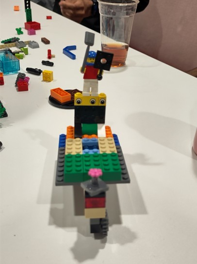{height=300}

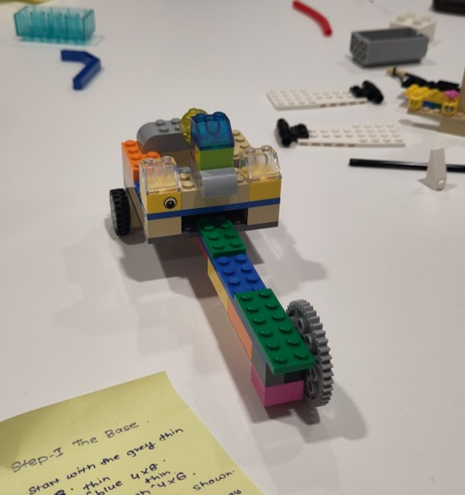{height=300}
:::

::: {layout-ncol=2}
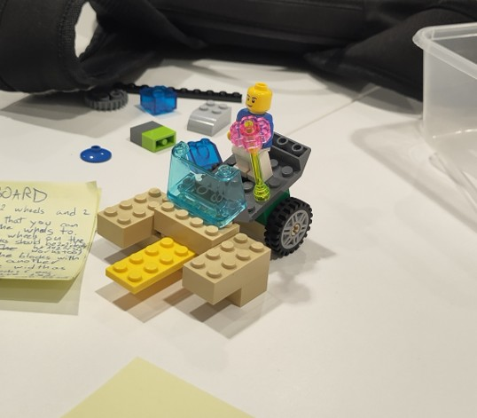{height=300}

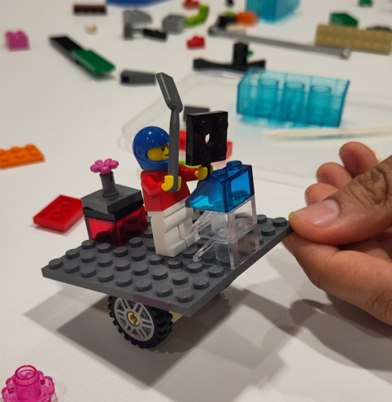{height=300}
:::

::: {layout-ncol=2}
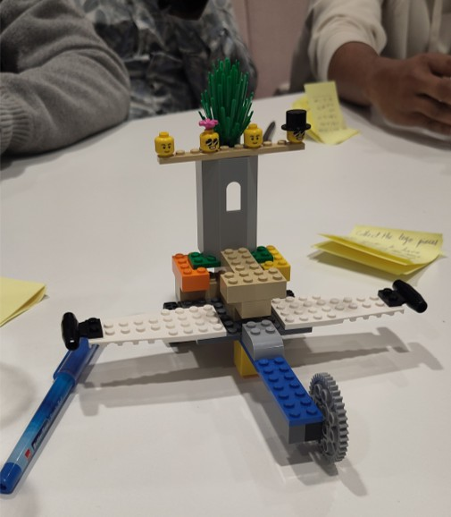{height=300}

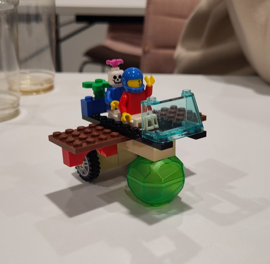{height=300}
:::

::: {layout-ncol=2}
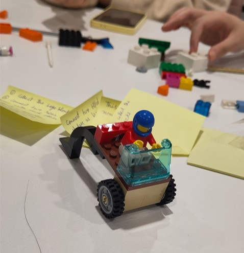{height=300}

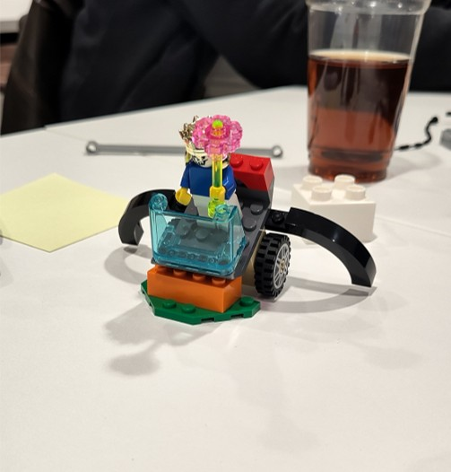{height=300}
:::

# What worked and what didn't (2)?

Making parts too specific could make people feel unsure of whether they could use an alternative. However, instructions that were too vague could end up with a less accurate end result. 

A high level quickstart allowed people to get start without worrying too much if they had the exact pieces. 

Knowing that you didn't neccessarily have the right pieces and aiming for close, not perfect led to some well adapted models.

# TL;DR

When writing instructions or documentation remember that you might have a different reference to others, try to make your steps clear enough to not need contextual knowledge. Adding a quickstart guide is a great way for people that prefer to work more immediately with their hands than reading the whole manual before starting. You don't know what tools and knowledge people will have when using your software, try to keep that in mind when writing your documentation.

# Links

[Check out the original work](https://eprints.gla.ac.uk/196477/).
The presentation from the session can be found [here](https://github.com/ubvu/bytes-and-bites/tree/main/presentations).