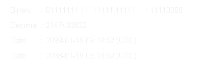

# Why is 64 more than twice as good as 32?

## The Y2K38 superbug

At 7 seconds past 3:14am (UTC, aka Coordinated Universal Time) on the 19th of January 2038 millions of devices will crash.
This is known as the 2038 problem.

  

> "_The 2038 problem is really a case study in technical debt and the long-term consequences of design decisions._"
>
> -- [Zoe Skyforest](https://hackaday.com/author/zoeskyforest/)

  

The problem appears in all devices or systems that use Unix time and store the value in a 32 bit signed integer. Let's break down what that means.

A bit a logical state that is either 1 or 0 (it is binary), on or off, true or false, yes or no. It is used to store values in computers where 1 bit can represent 0 or 1 and two bits can be 0 (00), 1(10), 3 (01) and 4 (11). Scaling this up means that 32 bits have $2^{32}$ different permutations resulting in a maximum value 4,294,967,295 (the first value is 0). An integer is a whole number and it being signed literally means that it can have a sign to signify if it is positive or negative. This leaves us with 2,147,483,647 as the maximum positive value the variable can be and -2,147,483,648 as the maximum negative value it can be.

Unix time starts at midnight UTC on the 1st of January 1970 (the Unix epoch). This date might look familiar to those used to working with datetimes or anyone who has had a device reset its clock. The time is then stored as the number of seconds since that moment and if you haven't made the connection yet 2,147,483,647 seconds after the Unix epoch is 03:14:07 19/01/2038 which at time of writing is less than 12 years away. 

Considering the rapid pace at which the tech world moves 12 years could seem like many lifetimes. However, it is worth noting that we are (at time of writing) fast approaching the 39th anniversary of the ever popular GIF format and it has been **37 years** since its last update. Not everything in the tech world moves fast.

# What will the damage be?

**What can we expect on this fateful day?** Well many devices won't see 03:14:08, they will instead experience [integer overflow](https://www.twingate.com/blog/glossary/integer%20overflow) as the value is larger than what the variable can hold and so the count starts over. All devices using a 32bit signed time will then think it is 2,147,483,647 seconds before the Unix epoch, 20:45:52 UTC on the 13th of December 1901, and I don't think anyone fancies using a victorian computer. So, any device that makes calculations based on time like interest rates, regularly timed intervals, logging, GPS or internet connections will be trying to use a timestamp nearing 150 years expired. That is not going to be a fun day for IT.

**What will the effect be?** Financial systems won't be able to track transactions after 2038 for one. Industrial, commercial, medical, government, and financial systems will not be able to keep regularly intervaled processes running on schedule (how many train delays might NS have that day?). Admins of databases and servers will not be able to effectively check or debug issues when they can't tell when they happened. Older devices won't be able to signal where they are and what data they have due to not being able to make satellite connections. Quite a broad effect.

**So what will be affected?** Well, plenty of legacy systems such as Windows XP, 32 bit Linux kernels and libraries, 32bit iPhones, OSX power PC Macs will suffer the change. More troublesome are embedded systems and micro controllers for things like your smart light in your flat, recording devices for field research, trackers on animals, or even someone's insulin pump. These all tend to have a 32 bit system and are so wide spread that replacinng or upgrading them all will be a feat. For anyone who has worked in a long running government facility you probably will have seen windows XP systems running software that is a nightmare to replace, this also extends to traffic lights and water treatment plants in some areas. Seeing how vital they are you can imagine they are a top priority target to update.

Some less terrifying examples of a low bit integer breaking a system or stopping progress include:

 * When Psy's [Gangnam Style](https://www.youtube.com/watch?v=9bZkp7q19f0) was the first video to reach 2,147,483,647 views in December 2014. Youtube had to swap to a 64bit value before it broke. 
 * In both [Old School Runescape](https://oldschool.runescape.com/) and [GTA V](https://www.rockstargames.com/gta-v/) there is a maximum currency of 2,147,483,647 Gp/$. 
 * In the 1985 classic 8bit game [Super Mario Bros.](https://supermarioplay.com/) surpassing 127 lives would result in it looping back to -128 lives and meaning you would lose the next time you died.

# How will it be fixed?

Well, as the initial title states swapping to a 64bit architecture and time system (sort of) solves it. It does just push the problem into the future, but seeing as a 64bit signed integer can store a value up to 9,223,372,036,854,775,807 we should have solved it by the year 292,471,210,647AD, right?

**What do I need to do?** Well, seeing as this is a software orientated group we should take a look at how this could affect your work and how to avoid it:

* Python's ``time.time()`` is 32bit if the system it's running on is 32bit, you can use ``datetime.now()`` instead.
* C/C++'s ``time_t`` is 32bit on 32 bit systems, use int64_t instead
* MYSQL's ``TIMESTAMP`` is based on 32bit Unix time, use ``DATETIME(6)`` instead.
* Avoid Java's ``java.util.Date`` and instead use ``java.time.Instant``.

# The older sibling, Y2K

For those of you who are old enough, you might remember the rising fear as the world approached the new millenium, 2000AD. Despite the incredibly wide legged jeans, croptops and chrome the world still felt ill at ease inview of the upcoming [Y2K bug](https://en.wikipedia.org/wiki/Year_2000_problem) and the theories surrounding its potential damage. 

The issue was partially due to the high price of RAM: any shortcuts that could be taken to conserve memory were taken. One of these shortcuts was storing years in two digits and adding the prefix "19" (I think you can see where this is going). This was already in practice long before fully digital computers when punch cards were still in use, anything to avoid cramping while punching all those holes. Systems using this two digit setup would of course see the new millenium arrive and assume it is 01/01/1900. Seeing as this was a software problem it was largely dealt with by large numbers of energetic programmers.

This was of course quite achievable at a time when very few people owned computers or mobiles compared to today.

# Conclusion

Tech debt is real and while it might not matter for most projects (majority are short term or one off solutions), you do need to consider longevity once you start building upon your software or creating solutions for others. Something that seems like a convenient shortcut now could lead to a horrendous worldwide refactor in the future so at least spend a little time considering the alternatives. And make sure to use 64bit integers for your times!

# Links & further reading

* [Wiki page for 2038 problem](https://en.wikipedia.org/wiki/Year_2038_problem)
* [Year 2038 Bug: What It Is, Why TIMESTAMP Fails, and How to Solve It](https://www.codegenes.net/blog/year-2038-bug-what-is-it-how-to-solve-it/)
* [The Epochalypse: It’s Y2K, But 38 Years Later](https://hackaday.com/2025/07/22/the-epochalypse-y2k-but-38-years-later/)
* [Vulnerabilities revealed by the y2k38 bug](https://www.securityweek.com/the-y2k38-bug-is-a-vulnerability-not-just-a-date-problem-researchers-warn/)
* [epoch2038.com](https://epoch2038.com/)