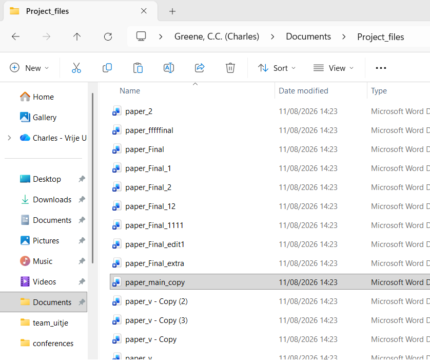

{height=300}

# Have you ever added "V0.1.0" to your commit message?

## Did you know if it was correct or did you just hope?

Once you're deep enough into programming it's time to face yet another fundamental of software development, versioning. 

Your commit messages are clear, concise, and more useful than your early messages consisting of "changed comment on line 143" or "fixed read_and_delete function". It's time to move to the big leagues and start adding versions to your commit messages to show you're a serious developer! But how? When does the number change? And why?

# What is versioning?

You will have seen it in use if you have ever stopped to look at your notifications for updates on your console, phone, computer, or other computerised device. Next update take a look, you'll notice that there is usually a line in the message mentioning the version. Most often it takes the form of a number looking a little like this: "v1.1.14". That's what we're looking at today.

Software development is typically an ongoing process. We release pieces of work that can function, but over time, add more features we didn't initially have time for, accomodate requests, fix bugs, adapt for changing hardware and dependencies, or simply never stop tinkering. To keep this never ending process somewhat sane and tidy we use versioning, the act of providing a number or name to correspond to a specific build/form of the software. It means that users, the developers, and anyone using the tool in their stack can track what works and what doesn't and at what point. If your program stops working, you could "revert to the previous version"; if your work relies on the software, you know which versions work with your stack; if you have a bug report, you can pin point it with the version. It's a useful thing! 

Within the world of software there are three main versioning systems, [Semantic Versioning](https://semver.org/), [date-based versioning](https://calver.org/), and named versions. Which one you choose is up to you and the needs of your software. 

# Names or numbers, which versioning system should I use?

The example used above was [Semantic Versioning](https://semver.org/), probably the most commonly used method for versioning and for good reason, but it can be a little confusing. It's probably more useful to think about an example of each first. 

Let's start with named versioning, one of the more prominent examples is the macOS. In 2001, Apple released version 10 of their operating system- OS X- and to highlight their new, even more design driven and user friendly approach to software development, they began using named releases starting with Cheetah (aka Mac OS X 10.0). This naming convention of big cats continued until 2013, when they swapped to locations in California. Themed naming conventions is pretty typical and helps to preserve the "product image". Perhaps try to think of something relevant to you, the team, or the software itself when deciding on a name/theme.

Date-based versioning might seem the most straightforward, after all newer is better, right? Well, there are several approaches you might come across for date-based such as VersionNumber.YYYYMMDD, or maybe just the full date YYYYMMDD, perhaps YY.MM is more your speed, or for more precision due to multiple bug fixes YYYYMMDDHMS. In general it is quite clear, your only issue might come up for people who are used to the MM/DD/YYYY format of dates and might expect YYYYDDMM as a result. One major example of this system is the latest long term support release of the Linux based operating system Ubuntu being 26.04 in reference to its April 2026 release.

Semantic versioning is probably the most common system in software development, but also the most tricky to use. Per the official Semantic Versioning guide the system is MAJOR.MINOR.PATCH where 

**MAJOR** = "version when you make incompatible API changes"

**MINOR** =  "version when you add functionality in a backward compatible manner"

**PATCH** =  "version when you make backward compatible bug fixes"

In this context, "backward compatible" means that it can work with older versions, in other words, the feature addition/fix won't break the way anyone might be using your software if they update it. Incompatible means that the changes will (likely) break the way others use your software. 

To make the decision you need to consider a few things such as:

-   How frequently do you plan to release? 
-   Will it be periodic? 
    *   In which case the date-based might be most suitable. 

-   Do you have a lot of features you plan to steadily release?
-   Do you expect there to be patches and bug fixes? (be honest)
    *   Then semantic is probably best. 

-   Do you favour larger and more distinct releases?
-   Do you want releases to have some personality? 
    *   Then a named release might be more your style. 

-   Do you want novelty and weirdness?
    *   Then why not make your own versioning system?

If you want a little inspiration for your novelty versioning system then look no further than TeX, the open source typesetting program (basis for LaTeX and MiKTeX). The creator, Donald Knuth, decided that no major changes would be made after 3.0. Only bug fixes have been made since then and each release adds another digit to the version number from $\pi$, meaning it tends towards a more accurate $\pi$ value every edition. Upon his death, he wishes for TeX to be frozen at v.$\pi$ meaning that ['_"bugs" will become permanent "features"_'](https://www.ntg.nl/maps/05/34.pdf). At the time if writing, the current TeX version is v.3.141592653

# How and when to use versioning?

There are several schools of thought on this, only on release, only internally, and for all changes to the main source code. Each comes with its own logic and reasoning. For instance, provision of a version **only at release** would mean it is purely for users, whether the versioning is for ease of bug reports or for marketing purposes would be up to you. **Only internally** would mean that it is important for development to be able to refer to specific builds, but users will expect to have a consistent (see backwards compatible) experience. "_For all changes_" versioning covers every base, with both users and developers able to use the version to communicate about the benefits or bugs of a specific build. 

The only exception to this is the ever rare separate version for internal to external. This is typically to provide a simplified of faux versioning system for better marketing or user friendliness while allowing developers to make sure they know exactly what build is being discussed when working on the code. Although this setup could make bug reports a little tricky.

The how to use versioning mostly comes down to consistency. If you are consistent in your use, whether on versioning system or time of use, it will make sure that development flows better for contributors and usage is easier for users. Whether you use versions only on the main branch, only at release, or for all pushes, make sure to stick to that system and make sure it is clear how it works. Do make sure that you have some way to refer to different builds both internally and externally though, for clarity of communication.

# TL;DR

Versioning is used to make communicating about different builds and software developments easier. You can choose between the main three systems of [Semantic Versioning](https://semver.org/), [date-based versioning](https://calver.org/), and named versions or if you are bold enough, you can make your own system instead. 
As long as you are consistent on when you use your versioning, and both users and developers can understand which build is being discussed, then it's working correctly.

# Links used as reference and further reading

Credit to [Devopedia.org](https://devopedia.org/images/article/279/7179.1593248779.png) for the article thumbnail.
-   [A best practice guide for software release versioning](https://launchdarkly.com/blog/software-release-versioning/)
-   [Wikipedia page of the software release life cycle](https://en.wikipedia.org/wiki/Software_release_life_cycle)
-   [Guide on semantic versioning and use in Git](https://medium.com/@wassimsakri/the-ultimate-guide-to-versioning-in-software-development-e846eb292a0d)
-   [Dutch guide on semantic versioning](https://q2-software.nl/blog/semantic-versioning/)
-   [Tips for versioning and releases when you have a userbase](https://www.cloudbees.com/blog/best-practices-when-versioning-a-release)
-   [An intro to semantic versioning in the context of good software release practices](https://victorpierre.dev/blog/beginners-guide-semantic-versioning/)
-   [A walk through of the life cycle of software release](https://axify.io/blog/software-release-lifecycle)
-   [An intro to the use of versioning in APIs and their tool for it](https://boomi.com/blog/what-is-api-versioning/)
-   [Wikipedia page for software versioning](https://en.wikipedia.org/wiki/Software_versioning)
-   ["_CalVer is a versioning convention based on your project's release calendar, instead of arbitrary numbers._"](https://calver.org/)
-   [A small tool to automate date-based versioning in your git repo](https://github.com/VincentBailly/date-based-version)